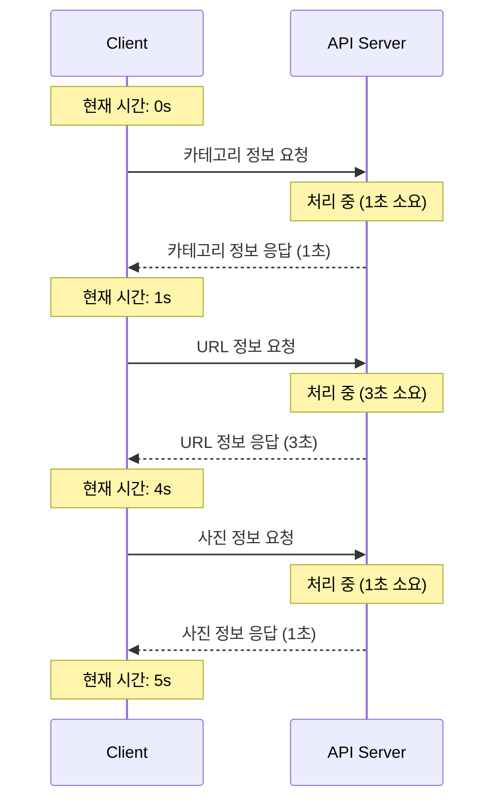
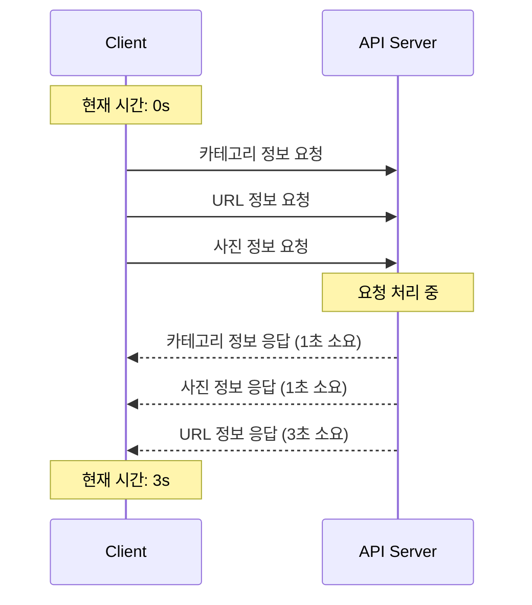
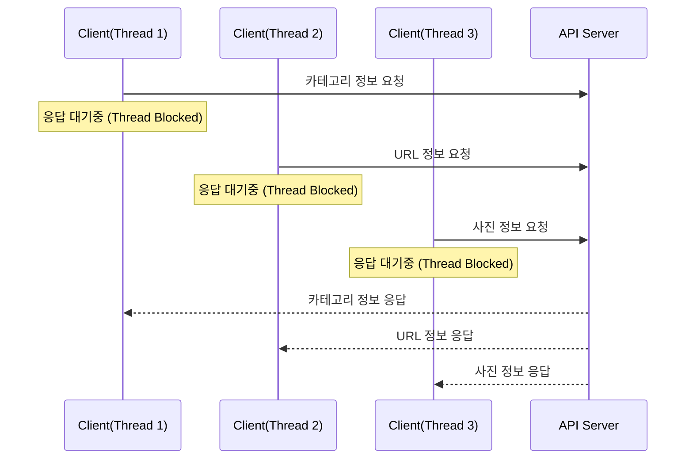
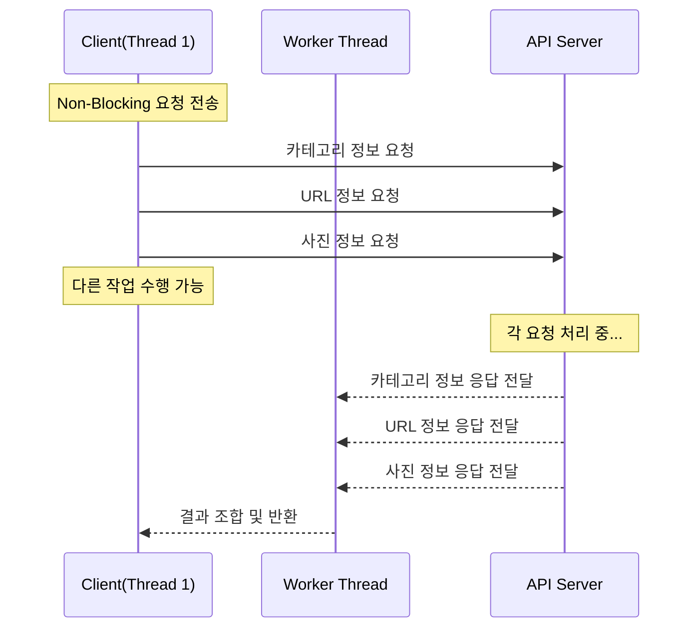

<div class="markdown-body">

모든 코드는 [깃허브](https://github.com/hbkuk/blod-code/tree/main/java/webflux-study)에 있습니다.

# 여러 외부 API 동기적으로 호출할 때 발생할 수 있는 문제

최근 흥미로운 문제를 고민하게 되었어요.

> 여러 외부 API를 동기적으로 호출할 때 성능 이슈가 발생하진 않을까?

예를 들면, 음식 배달 앱에서 사용자 요청을 처리할 때 외부 API 호출이 지연된다면 사용자가 느끼는 대기 시간이 길어질 수 있는데요.  
이러한 상황에서 효율적인 API 호출 방법을 고민해볼 필요가 있을 것 같아요. 
 
이에 대해 고민했던 내용을 정리해보았습니다.  

## 동기적(Synchronous)으로 여러 외부 API 호출

HTTP 요청을 위해서 사용했던 라이브러리는 `spring-boot-starter-web` 모듈에서 제공하는 `Rest Template` 이었어요.  
간단하게 예제 코드를 살펴볼게요.

```
// FoodService.java

public String getFoodById(String id) {
    
    // 1. 카테고리 정보를 얻는 외부 API 호출 (동기)
    String categoryResponse = restTemplate.getForObject(
        "http://localhost:8081/api/food/category/{id}", String.class, id);
    
    // 2. URL 정보를 얻는 외부 API 호출 (동기)
    String urlResponse = restTemplate.getForObject(
        "http://localhost:8081/api/food/url/{id}", String.class, id);
    
    // 3. 사진 정보를 얻는 외부 API 호출 (동기)
    String photoResponse = restTemplate.getForObject(
        "http://localhost:8081/api/food/photo/{id}", String.class, id);
    
    return categoryResponse + urlResponse + photoResponse;
}
```

이 코드는 동기적으로 실행되는데요.  

만약, 2번 단계(URL 정보를 얻는 과정)에서 예상한 시간보다 지연되는 경우에는 어떤일이 벌어질까요?

예를 들면, 다음과 같은 상황을 가정해 볼 수 있겠네요.    
(`Network I/O` 시간은 제외하고, 처리시간만 고려했어요.)




위 다이어그램을 보면, 총 5초(1s + 3s + 1s)가 소요됩니다.

2번 단계에서 요청 후 응답을 받기까지 3초가 소요되었고, 2번 응답을 기다린 후 3번 단계가 실행되었습니다.  
이는 서비스를 운영 중 충분히 발생할 수 있는 상황이라고 볼 수 있을 것 같아요. 

위와 같은 문제를 해결하기 위한 여러 방법이 있을 것이라고 예상되는데요.  
현재 API 호출 방식을 동기 방식에서 비동기 방식으로 변경해본다면 해결할 수 있지 않을까요?  

## 비동기적(Asynchronous)으로 여러 외부 API 호출

`Rest Template`은 동기적 요청 방법을 제공하고 있지만, 비동기 요청 방식은 지원하지 않습니다.

`Java 8(Java SE 8)`부터 추가된 `CompletableFuture`를 사용하면 비동기 요청이 가능해지는데요.  
이를 활용한 코드를 살펴보겠습니다.   

```
public String getFoodById(String id) throws ExecutionException, InterruptedException {
    
    // CompletableFuture로 비동기 API 호출 설정
    CompletableFuture<String> categoryFuture = CompletableFuture.supplyAsync(() -> {
        System.out.println("Category request executed by thread: " + Thread.currentThread().getName());
        return restTemplate.getForObject("http://localhost:8081/api/food/category/{id}", String.class, id);
    });
    
    CompletableFuture<String> urlFuture = CompletableFuture.supplyAsync(() -> {
        System.out.println("URL request executed by thread: " + Thread.currentThread().getName());
        return restTemplate.getForObject("http://localhost:8081/api/food/url/{id}", String.class, id);
    });
    
    CompletableFuture<String> photoFuture = CompletableFuture.supplyAsync(() -> {
        System.out.println("Photo request executed by thread: " + Thread.currentThread().getName());
        return restTemplate.getForObject("http://localhost:8081/api/food/photo/{id}", String.class, id);
    });
    
    // 모든 요청이 완료될 때까지 기다림
    CompletableFuture<Void> allFutures = CompletableFuture.allOf(categoryFuture, urlFuture, photoFuture);
    
    // 모든 응답을 받고, 각각의 결과를 조합하여 반환
    allFutures.join(); // 모든 비동기 작업이 완료될 때까지 기다림
    
    String categoryResponse = categoryFuture.get();
    String urlResponse = urlFuture.get();
    String photoResponse = photoFuture.get();
    
    return categoryResponse + urlResponse + photoResponse;
}

```

비동기 호출 시 발생하는 동작을 다이어그램으로 표현해 보겠습니다.



3건의 API 요청이 동시에 시작되어, 최장 처리 시간(3초)에 모든 작업이 완료됩니다.

현재 API 요청은 비동기적으로 실행되고 있는데요.  
잠시 애플리케이션 내에서 어떻게 실행되고 있는지 확인해볼까요?

---

### 실행 로그 확인

우선, `getFoodById` 메서드가 실행되었을 때의 로그를 살펴볼게요.

```
Category request executed by thread: ForkJoinPool.commonPool-worker-1
Photo request executed by thread: ForkJoinPool.commonPool-worker-2
URL request executed by thread: ForkJoinPool.commonPool-worker-3
```

로그를 살펴보니, 해당 요청은 `ForkJoinPool`에 있는 `Thread`가 사용된 것으로 확인되는데요.

`ForkJoinPool` 에 대해서 궁금하신 분들이 있을 것이라고 생각되는데요.  
아래 내용을 참고해주세요.

### ForkJoinPool

- Java 7부터 제공된 병렬 작업을 처리하는 스레드 풀
- JVM 수준에서 공유되며 CPU 코어 수에 따라 기본적으로 생성
- `CompletableFuture`를 사용할 경우 기본적으로는 `ForkJoinPool`의 공용 스레드 풀을 사용하지만, 커스텀 스레드 풀(Executor) 사용 가능  

```
// 커스텀 스레드 풀 사용 예
Executor customExecutor = Executors.newFixedThreadPool(5);

CompletableFuture.supplyAsync(() -> {
    System.out.println("Task executed on: " + Thread.currentThread().getName());
    return "Hello, Custom Executor!";
}, customExecutor);
```

다시 로그를 살펴볼게요.

각각의 외부 API 요청에 사용되는 `Thread`는 서로 다릅니다. 이는 어떤 의미일까요?

각 API 요청이 응답을 받을 때까지 동일한 `Thread`가 점유된 상태로 대기하고 있다는 의미와 동일한데요.  
해당 포스팅에서는 '`Blocking` 특성을 가지고 있다' 라고 표현하겠습니다.

이해를 돕기위해 다이어그램으로 살펴볼게요.



위 처럼 요청이 처리되는 동안 `Thread`가 차단되며, 다른 작업을 수행하지 못하는 `Blocked` 상태가 됩니다.

그럼, 지금까지의 내용을 정리해보겠습니다.

- `RestTemplate`: 동기 API 호출, Blocking 특성
- `RestTemplate & CompletableFuture`: 비동기 API 호출, Blocking 특성 

위와 같이 정리해보았는데요. 한가지 더 고민해보겠습니다.

> 만약, 시스템의 규모가 점점 더 커지고 외부 API 호출이 점차 많아지는 상황이 된다면 어떤 상황이 발생할까요?

각각의 외부 API 요청에 쓰레드가 할당되니, 쓰레드 풀이 고갈될 가능성이 있는데요.    
`Non-Blocking`으로 진행된다면 이 문제를 해결할 수 있지 않을까요?

## 비동기(Asynchronous) & Non-Blocking I/O 기반 여러 외부 API 호출

`Non-Blocking`으로 진행된다는 의미가 어떤 의미일까요?

아래 다이어그램으로 살펴볼게요.



위처럼 `Client(Thread 1)`가 요청을 즉시 반환하고 다른 작업을 수행하고 있습니다.  
또한, 응답이 전달된 후 별도의 `Worker Thread`가 수행되고 있는데요.

이처럼 동작하면, 동기 방식에서 발생할 수 있는 자원 점유 문제를 해결하고 스레드 풀을 효율적으로 사용할 수 있어요.  

### Spring WebFlux로 구현하기 

이를 Java & Spring 프로젝트에서 어떻게 구현할 수 있을까요?  
대표적으로 `WebFlux`를 사용해볼 수 있는데요. 간단하게 코드로 살펴볼게요.

```
public Mono<String> getFoodById(String id) {
    String categoryUrl = String.format("http://localhost:8081/api/food/category/%s", id);
    String urlInfoUrl = String.format("http://localhost:8081/api/food/url/%s", id);
    String photoUrl = String.format("http://localhost:8081/api/food/photo/%s", id);
    
    // 각 API 호출을 비동기적으로 수행하며 스레드 이름 출력
    Mono<String> categoryMono = webClientUtil.get(categoryUrl, String.class)
        .subscribeOn(Schedulers.boundedElastic())
        .doOnSubscribe(sub -> System.out.println("Category request subscribed on: " + Thread.currentThread().getName()))
        .doOnNext(response -> System.out.println("Category response received on: " + Thread.currentThread().getName()));
    
    Mono<String> urlInfoMono = webClientUtil.get(urlInfoUrl, String.class)
        .subscribeOn(Schedulers.boundedElastic())
        .doOnSubscribe(sub -> System.out.println("URL Info request subscribed on: " + Thread.currentThread().getName()))
        .doOnNext(response -> System.out.println("URL Info response received on: " + Thread.currentThread().getName()));
    
    Mono<String> photoMono = webClientUtil.get(photoUrl, String.class)
        .subscribeOn(Schedulers.boundedElastic())
        .doOnSubscribe(sub -> System.out.println("Photo request subscribed on: " + Thread.currentThread().getName()))
        .doOnNext(response -> System.out.println("Photo response received on: " + Thread.currentThread().getName()));
    
    // 모든 API 호출이 완료되었을 때 결과를 조합하며 스레드 이름 출력
    return Mono.zip(categoryMono, urlInfoMono, photoMono)
        .map(tuple -> {
            System.out.println("Mapping results on: " + Thread.currentThread().getName());
            String categoryResponse = tuple.getT1();
            String urlResponse = tuple.getT2();
            String photoResponse = tuple.getT3();
            
            return categoryResponse + urlResponse + photoResponse;
        });
}
```

### 실행 흐름 확인

위 메서드가 실행된 후 로그를 살펴볼게요.

```
Category request subscribed on: http-nio-8080-exec-6
URL Info request subscribed on: http-nio-8080-exec-6
Photo request subscribed on: http-nio-8080-exec-6
Category response received on: reactor-http-nio-12
URL Info response received on: reactor-http-nio-14
Photo response received on: reactor-http-nio-17
Mapping results on: reactor-http-nio-17
```

- `doOnSubscribe` 로그: 요청이 시작된 순간 동일한 `Thread`에서 모든 요청이 시작됨을 알 수 있어요.
- `doOnNext` 로그: 응답이 발행될 때, 각각 다른 `Thread`에서 처리된 것을 확인할 수 있어요.

더 궁금한 내용이 있으신 분들은 `WebFlux`와 `Reactor`에 대해 학습해 보시는 것을 추천드려요.  

이제 지금까지의 내용을 정리해보고 마무리해볼게요.  

## 정리

- 동기(Synchronous) & Blocking I/O
  - 특징
    - 요청이 처리되는 동안 요청을 보낸 `Thread`는 작업을 중단하고 대기 상태
    - 요청이 순차적으로 실행되므로, 하나의 요청이 지연될 경우 전체 처리 시간 증가

- 비동기(Asynchronous) & Blocking I/O
  - 특징
    - 요청은 비동기적으로 시작되지만, 요청을 처리하는 동안 각각의 `Thread`가 응답을 기다리며 `Blocked` 상태가 됨.
    - 동시 요청 처리량은 증가할 수 있지만, 쓰레드 풀이 고갈될 가능성이 있음
      - `Blocking I/O`로 인해 많은 Thread가 대기 상태로 점유될 수 있음.

- 비동기(Asynchronous) & Non-Blocking I/O
  - 특징
    - 요청은 하나의 `Thread`에서 비동기적으로 진행
    - 요청 대기 중 `Thread`가 점유되지 않으며, 응답이 올 경우 `Worker Thread`에서 처리

### 참고
- https://11st-tech.github.io/2024/01/04/completablefuture/

</div>