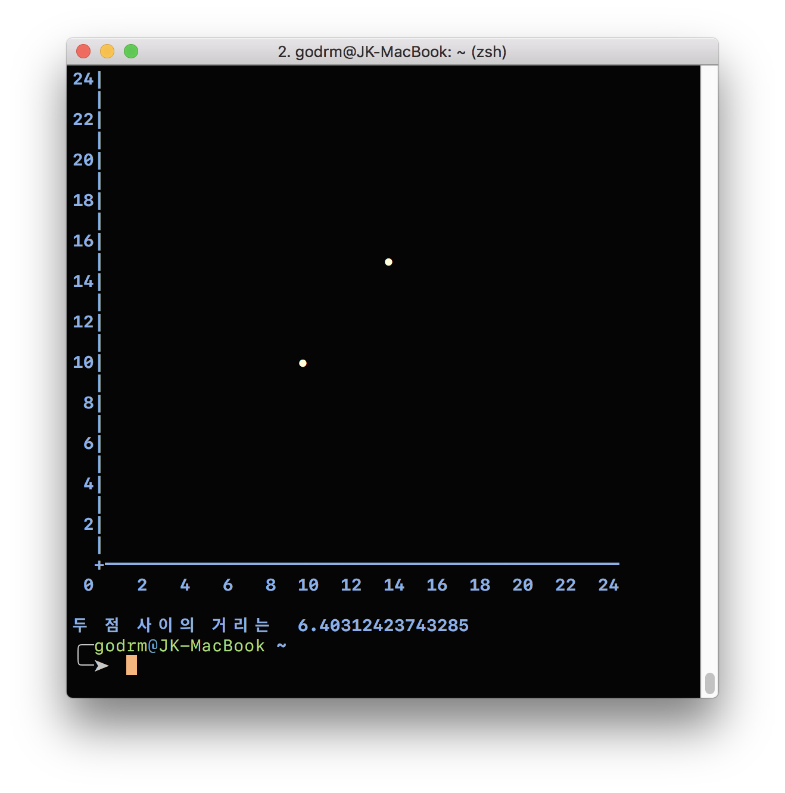
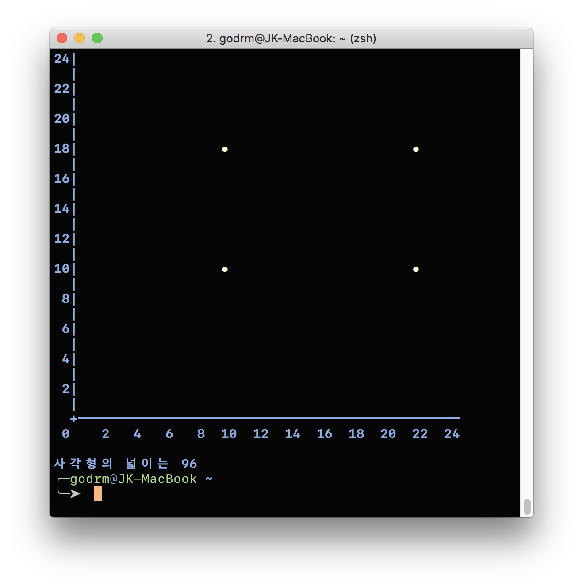
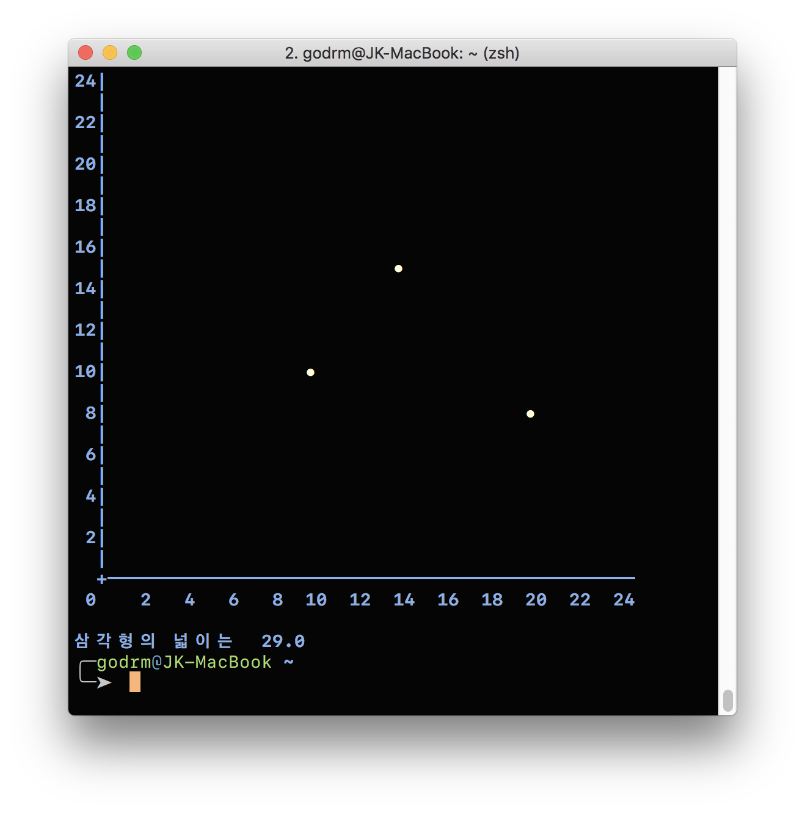

  

###### 해당 글은 [NEXTSTEP 자바 플레이그라운드 with TDD, 클린 코드](https://edu.nextstep.camp/s/RFY359FE/ls/NbhqZkLH)를 통해서 새롭게 배우고 내용을 기록한 글입니다.  

## 좌표계산기(선 길이, 사각형 면적, 삼각형 면적)  

기능 요구사항은 다음과 같다.  

- 선 길이
    - X, Y좌표 모두 최대 24까지만 입력
    - **좌표값을 두 개 입력한 경우, 두 점을 있는 직선**으로 가정
    - 직선인 경우는 두 점 사이 거리를 계산해서 출력  
    - 출력 결과

   

- 사각형 면적
    - **좌표값을 네 개 입력한 경우, 네 점을 연결하는 사각형**으로 가정
    - 네 점이 뒤틀어진 사다리꼴이나 마름모는 제외하고 직사각형만 허용하도록 검사
    - 사각형인 경우 사각형의 넓이를 계산해서 출력
    - 출력 결과

   

- 삼각형 면적
    - **좌표값을 세 개 입력한 경우, 세 점을 연결하는 삼각형**으로 가정
    - 삼각형인 경우 삼각형의 넓이를 계산해서 출력
    - 출력 결과
  

## 요구사항 정리
- **직선, 사각형, 삼각형의 좌표 정보를 저장하는 클래스**가 필요하다.
    - X, Y좌표의 최댓값은 최대 24까지이며, 이를 검증하는 로직을 책임진다.
    - 좌표와 좌표 사이의 거리를 계산하는 로직을 책임진다.
- 좌표 리스트를 전달받아 **직선인지, 사각형인지, 삼각형인지 확인하는 클래스**가 필요하다.
    - 최종적으로 각 도형마다 도형의 이름(Name), 계산 결과(result)가 필요하다.  

## 클래스 분리 및 다이어그램  

- `FigureFactory Class`
    - getFigure(List<Point> points) : Figure
        - List<Point> 객체를 매개변수로 전달받아 List의 사이즈를 확인 후 Figure 객체를 반환

- `Figure Abstract Class`
    - getName(), getSize(), getArea()
        - 공통되는 부분으로, 하위(자식)클래스에서 구현하도록 한다.

- `Line, Rectangle, Triangle Class`
    - 각각 getName(), getSize(), getArea() 구현

- `Point Class`
    - getDistance(Point other) : double
        - 현재 Point 객체와 매개변수로 전달받은 다른 Point 객체와의 거리를 계산 후 반환

## 인터페이스(interface)로 구현  

   

  

위 로직도 충분히 **유연성 있는 설계**라고 생각한다.  

다음 단계로 나아가기 위해서, 인터페이스로 구현하는 이유에 대해서 잠시 살펴보고 가자.  

- interface는 자바에서 **한 단계 더 높은 추상화**를 하기 위해 사용
- 구현 로직은 존재하지 않으며 **메소드에 대한 입력(input), 출력(output)만 정의**
- 변경이 발생할 경우 소스 코드에 변경을 최소화함으로써 유지보수 비용을 줄이고, 변화에 빠르게 대응하기 위함
- 추상화를 함으로써 미래의 변화에 빠르게 대응할 수 있지만 **추상화를 하려면 추상화에 따른 개발 비용이 발생**  

더 개선할 부분이 있는가? ..   

